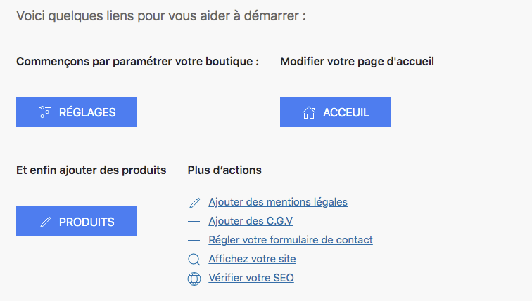
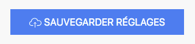

Lors de votre connexion, vous arrivez sur le tableau de bord de votre boutique en ligne. 

Vous disposez de 3 boutons qui vous permettent de : 
- effectuer les réglages et les paramètres de votre boutique
- modifier votre page d’accueil
- ajouter des produits

En plus des boutons, des liens vers d’autres actions sont disponibles : 
- ajouter les mentions légales
- ajouter les conditions générales de vente
- paramétrer votre formulaire de contact
- voir votre boutique en ligne
- vérifier votre référencement naturel

!!!! Pour commencer le paramétrage de votre boutique en ligne, cliquez sur le bouton réglages. 

!! À fin de chaque page, vous trouverez un bouton bleu nommé SAUVEGARDER RÉGLAGES. N’oubliez pas de cliquer sur ce bouton chaque fois que vous procédez à un changement des informations sur une page, sinon vos modifications ne seront pas prises en compte dans votre boutique. 

