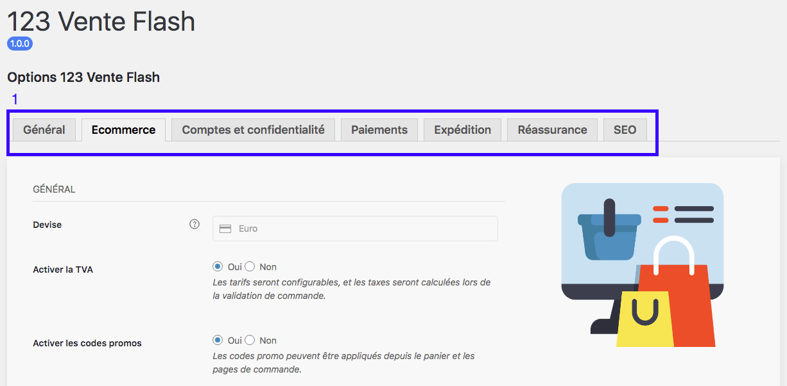

Maintenant que les paramètres généraux de votre boutique sont remplis, cliquez sur l’onglet Ecommerce (1). 

Dans cette rubrique, vous devez choisir les paramètres généraux directement liés à votre boutique comme : 

- la devise : la devise est l’euro uniquement
- la TVA : vous pouvez choisir d’activer ou non la TVA sur le prix de vente de votre produit. Le taux de TVA sera à choisir plus tard, pour chaque produit (lien), dans la rubrique boutique (lien)
- les codes promos : vous pouvez choisir de fonctionner avec des codes promotionnels que vous pourrez ensuite renseigner dans chaque produit (lien) depuis votre boutique. À noter qu’il est également possible de planifier une durée de promotion.
- calculer les remises de codes promo séquentiellement : vous avez la possibilité de proposer des remises qui se calculent en cascade par rapport au prix de base.  
- activer les avis : vous pouvez choisir de laisser la parole à vos clients en activant ou non la possibilité de laisser des avis sur chaque produit acheté. 

!! Lorsque tous les champs sont remplis, n’oubliez pas d’appuyer sur le bouton *sauvegarder réglages*.

>>>>> Notez que le système des avis vérifiés ou certifiés n'est pas inclus dans votre boutique.