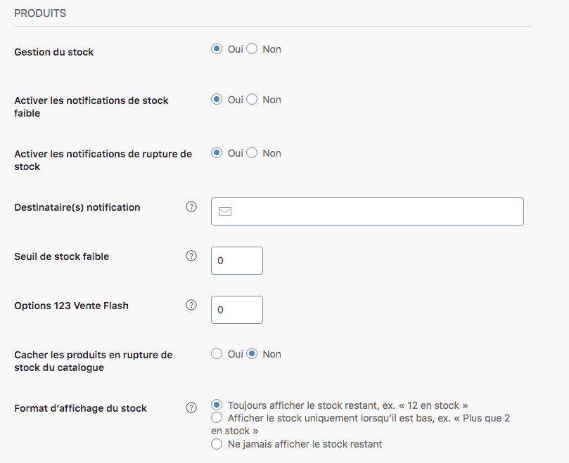

Le prochain paramètre à renseigner concerne vos produits. Il s’agit, dans cette rubrique, d’activer ou non certains paramètres. La liste de vos produits à vendre sera à renseigner plus tard dans le guide, dans la rubrique [Produits](https://guide.123venteflash.com/boutique/catalogue/produits-simples)

>>>>>> Pensez à bien renseigner l'email du destinataire des notifications. Ces emails vous aideront à gérer votre stock lorsque le seuil d'alerte est atteint, ainsi vous pourrez anticiper et vous réapprovisionner avant d'être en rupture et ainsi ne manquer aucune vente. 

