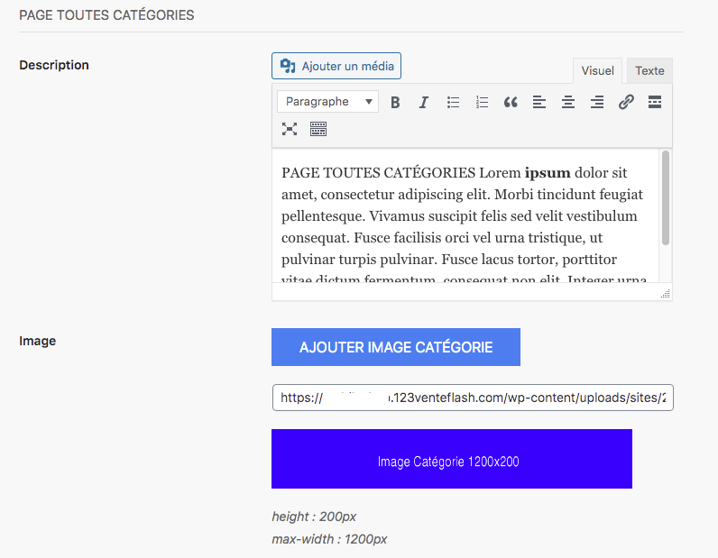

La partie suivante est celle qui concerne les paramètres de page catégories de votre boutique. 

Dans ces paramètres, vous pouvez choisir :

* Description : il s’agit d’intégrer du contenu pour présenter votre page catégorie, placer quelques mots-clés intéressants pour votre référencement naturel. Vous n’êtes pas limité en nombre de mots. En général, 200 à 300 mots permettent d’obtenir des résultats intéressants.
* Image : il est possible d’ajouter une image de couverture pour votre page catégories pour illustrer votre contenu. 

>>>>> Vous pouvez ajouter une image depuis votre [bibliothèque de médias](https://guide.123venteflash.com/divers/media/bibliotheque-media) 

Exemple :

