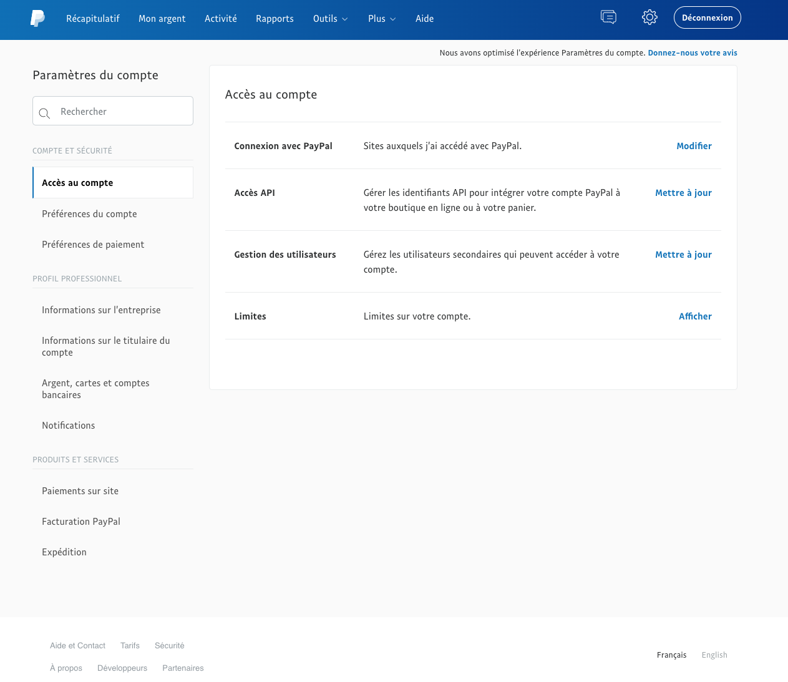
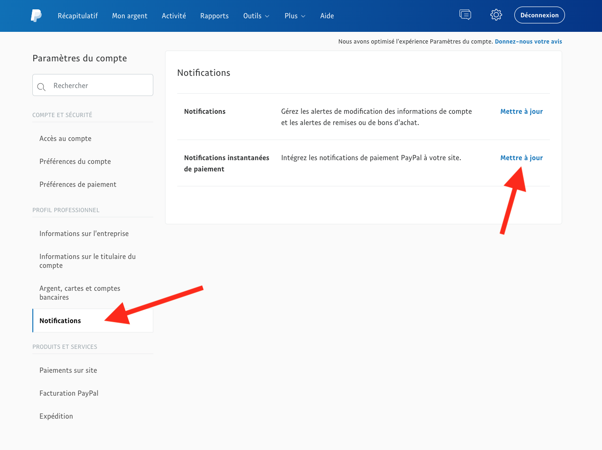
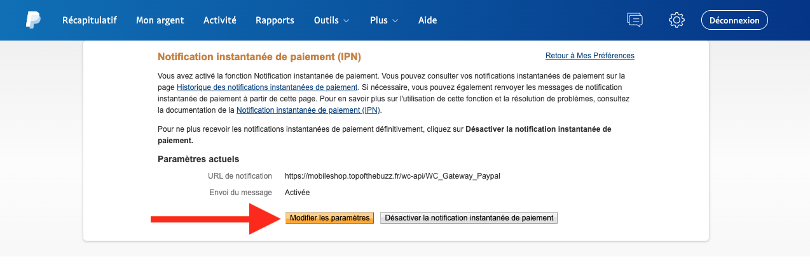
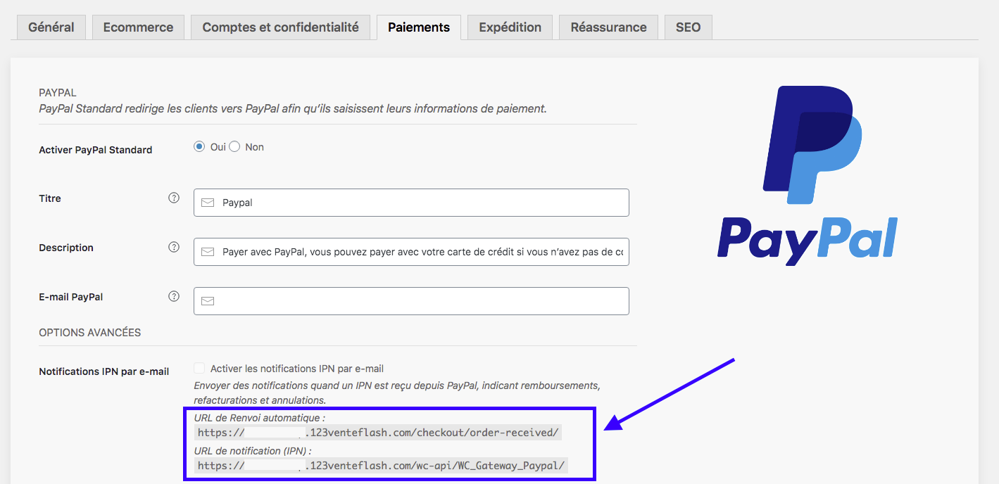
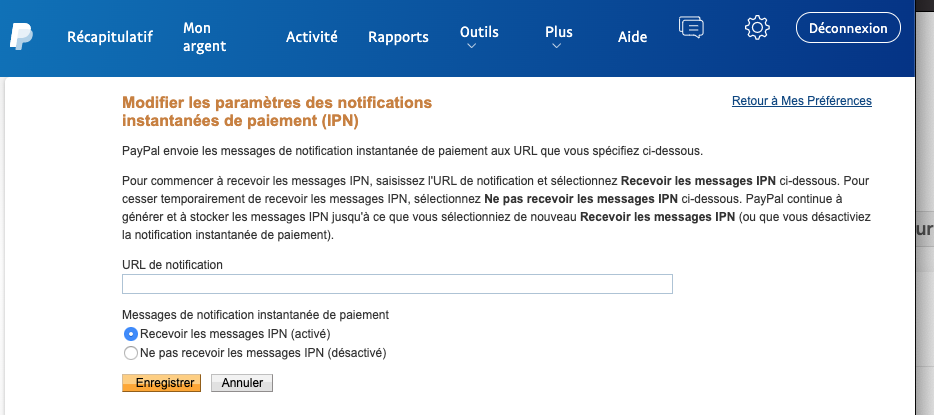
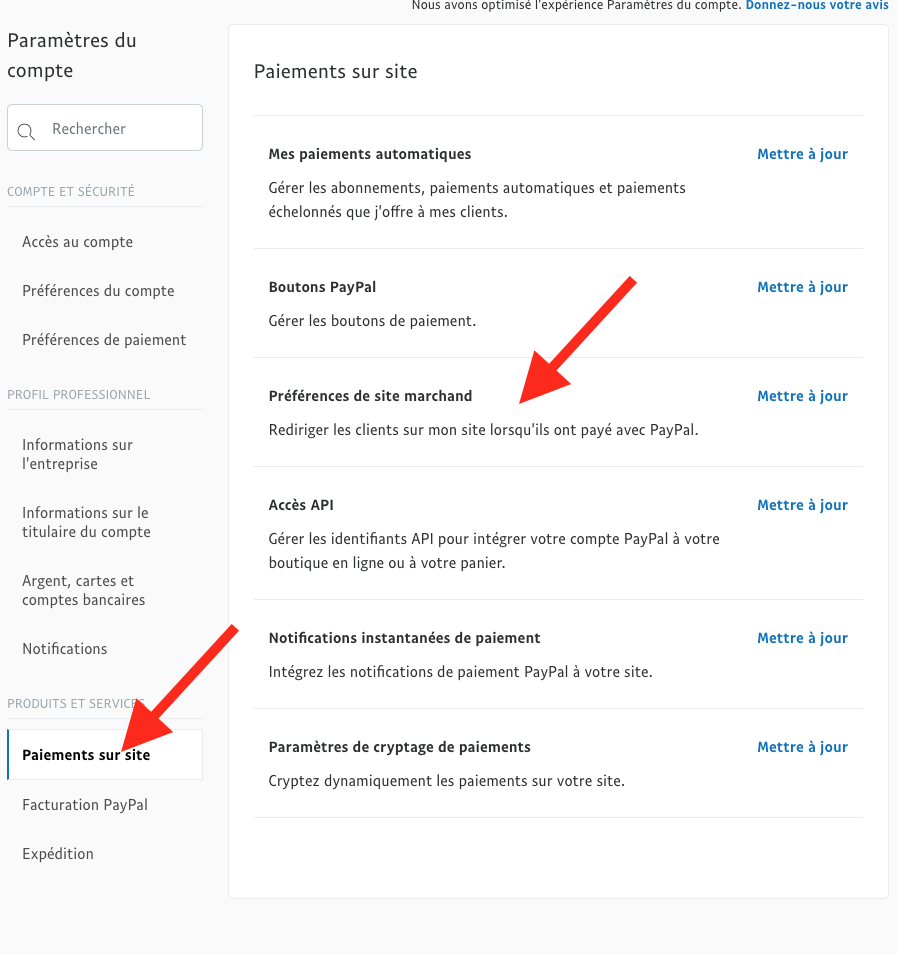
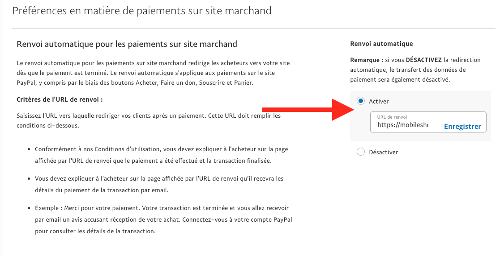
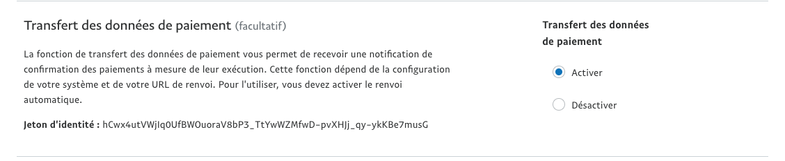

### Première étape : remplir les critères dans votre boutique

Depuis cette interface, il faut : 
- activer le système de paiement Paypal
- remplir le titre  que votre client va voir lors de sa commande a moment où il sera rediriger vers la plateforme Paypal. 
- définir la description, le texte que votre client va voir sur la page de redirection vers Paypal. 
- renseigner votre adresse mail paypal pour que vous puissiez réceptionner les paiements de vos clients. 

### Seconde étape : remplir les critères dans votre page Paypal

Dans un premier temps, vous devez vous connecter à votre compte [Paypal](https://www.paypal.com/fr/home) (ou à défaut créer votre compte professionnel - et non personnel - directement sur la plateforme de paiement). 

La création d'un compte paypal professionnel est gratuite mais nécessite toutefois une vérification de leur part (notamment pour vos coordonnées bancaires) et peut prendre un jour ou deux. Pensez à prendre en compte ce temps indépendant de notre volonté lors du paramétrage de votre boutique sur notre générateur. 

Une fois connecté, rendez-vous dans les paramètres intitulés (cliquez sur la roue en haut à droite dans le bandeau bleu ) : accès au compte 

Ensuite, Dans le menu colonne de gauche, cliquez sur Notifications puis Notifications instantanées de paiement et enfin mettre à jour. 

Vous arrivez ensuite sur les paramètres de notification, il faut cliquer sur le bouton Modifier les paramètres. 

Maintenant, il faut récupérer l'adresse qui est indiquée dans votre générateur (vu en première étape). C'est l'adresse IPN qui nous intéresse pour récupérer les règlements clients par PayPal :

Il faut ensuite copier-coller l'adresse *URL IPN* dans la case dédiée et cliquez sur le bouton enregistrer :

Retournez ensuite au Paramètres du compte Paypal en cliquant sur la roue dans le bandeau bleu (en haut à droite). Choisissez ensuite les Paiements sur site puis les Préférences de site marchand. Cliquez sur Mettre à jour. 

Cette fois-ci copiez l'adresse *URL de renvoi automatique* depuis votre générateur : 

Retournez sur Paypal et collez l'adresse pour recevoir vos paiements sur vos comptes : 

Pour l'étape finale, il faut activer le transfert de données des paiements.

C'est fait ! 