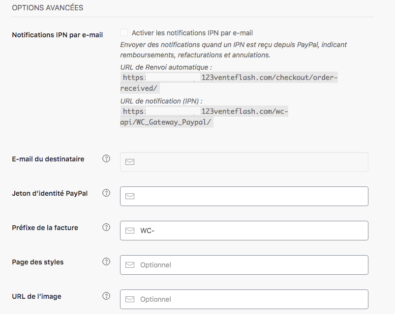

Maintenant que votre compte PayPal est paramétré et que vous avez accès au système de paiement, il vous reste à paramétrer les options avancées : 

Remplissez donc : 

- Les notifications IPN par email si vous souhaitez les recevoir
- Si vous avez activé les notifications, vous pouvez renseigner l’email du destinataire des notifications
- Jeton d’identité PayPal
- Le préfixe de la facture

En option : 
- La page des styles
- L’URL de l’image