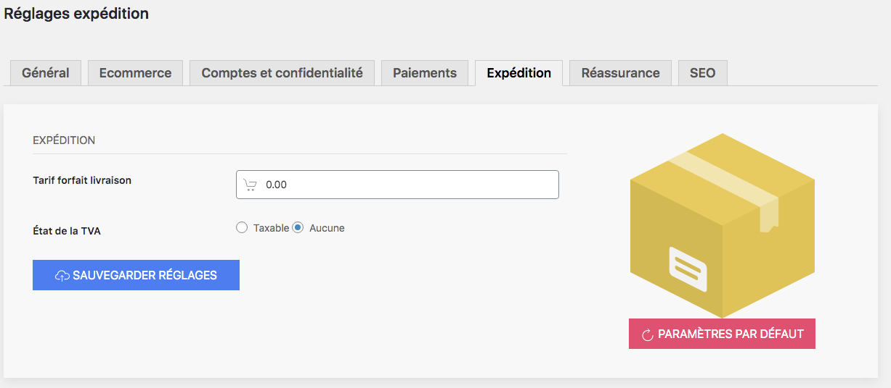

Vous disposez de votre catalogue, de vos catégories, d’une boutique en cours de paramétrage, et il est temps de vous pencher sur un autre élément : l’expédition de vos produits. 

Dans cette rubrique, vous pouvez définir le tarif de vos frais de port. Vous n’avez qu’un seul tarif à indiquer sous la forme d’un forfait. 

