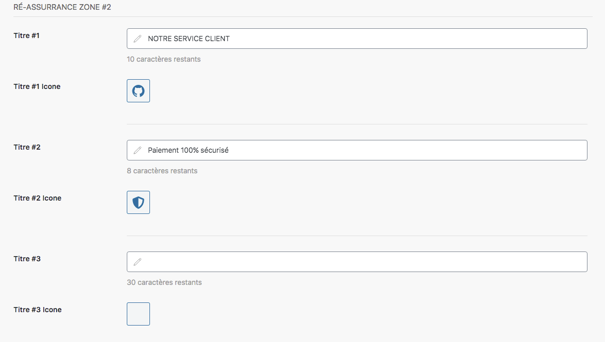
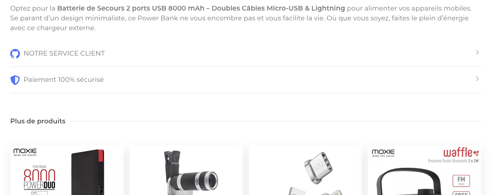

La zone 2 de réassurance est située plus bas dans la fiche produit. Le paramétrage est exactement le même que dans la zone 1. 

Vous pouvez remplir les mêmes champs :
- titre
- icône 
- contenu

Dans la fiche produit, vous pouvez donc rentrer jusqu'à 6 éléments de réassurance. 

Exemple en ligne :

