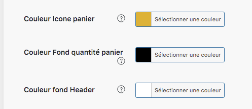

Dans cette rubrique, vous avez la possibilité de modifier plusieurs couleurs, en dehors de celle du style, comme : 

- La couleur du panier (dans le menu en haut à droite)
- la couleur de la pastille indiquant le nombre de produits dans le panier
- la couleur du fond du header (menu)

Ici, nous avons donc un fond blanc, avec un panier jaune or et une pastille noire. Exemple : 

