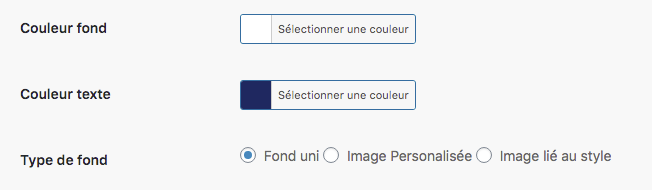
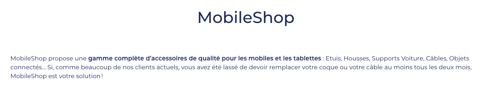

Tout comme les couleurs, vous pouvez choisir de mettre un fond dans votre page d’accueil, le laisser blanc ou bien encore mettre une image de votre choix. 

Ici, nous avons choisi un fond blanc et une écriture bleue. Le fond est donc uni, mais pourrait être une image personnalisée ou une image liée au style de la page d’accueil. 

Laissez-vous tenter par ce qui vous plaît. Exemple : 

