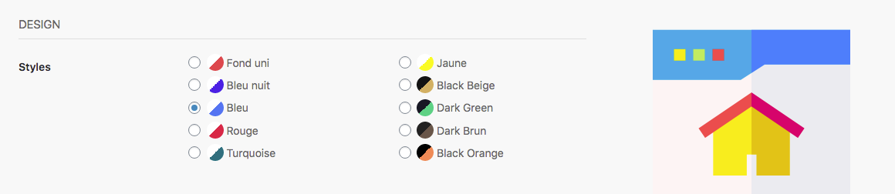
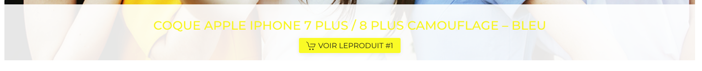
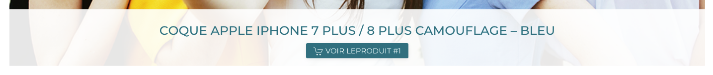

Comme pour toutes les boutiques en ligne, vous avez la possibilité de modifier le style de la page d’accueil pour qu’elle vous ressemble et mette au mieux en valeur vos produits. 

Vous avez, à votre disposition, plusieurs éléments dont :

- le style
- les couleurs
- le fond (image ou couleur)
- le slider

Le style impacte plusieurs éléments dans la page d’accueil dont : 
 
- La couleur des boutons
- Les barres de séparation des éléments
- Les accroches du slider

Exemple en jaune : 

Exemple en turquoise : 

