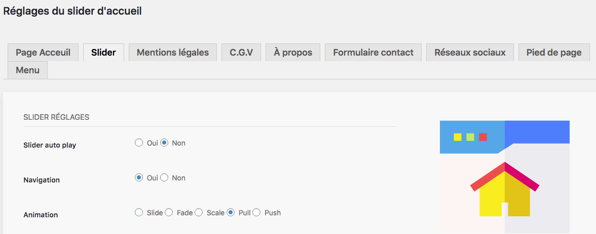
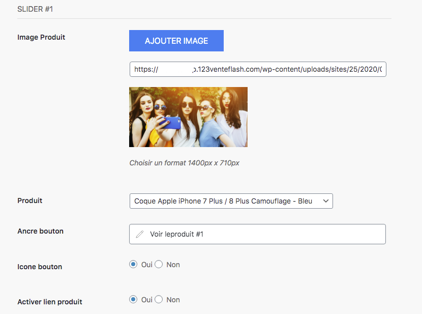

Maintenant que vous avez rempli le contenu et choisi le nombre de produits à faire apparaître ainsi que le design que vous vouliez, vous pouvez renseigner les images du slider. 

Vous avez plusieurs réglages à renseigner comme : 
- l’auto play : il s’agit de choisir si les images défilent automatiquement lorsque le visiteur arrive sur la page. 
- navigation : si vous souhaitez que votre visiteur puisse cliquer sur l’image ou le titre du slide, pensez à cocher oui dans la rubrique navigation.
- animations : ce sont les effets visuels à votre disposition qui donnent le dynamisme à votre slider. Testez pour savoir celui qui vous convient le mieux. 

## Renseigner les slides 

Ensuite, il vous reste à renseigner les images qui serviront à alimenter votre slider. On les appelle les slides. 

Pour commencer, choisissez l’image n° 1 qui vous convient, en cliquant sur le bouton AJOUTER IMAGE. Vous arrivez donc dans la [bibliothèque des médias](https://guide.123venteflash.com/divers/media/bibliotheque-media) pour choisir la photo. Si celle-ci n’est pas dans la bibliothèque, reportez-vous dans la rubrique pour suivre la procédure d’insertion d’une image. 

Choisissez ensuite le produit que vous souhaitez mettre en valeur. Cela signifie que vous devez remplir votre [catalogue de produits](https://guide.123venteflash.com/boutique/catalogue) au préalable. 

Le paramètre suivant est l’ancre du bouton, il s’agit de renseigner le texte qui apparaître sur le CALL TO ACTION, le bouton qui incite le visiteur à cliquer pour accéder à la page voulue. 

Vous pouvez également choisir de faire apparaître une icône à côté de l’ancre (1). 

Exemple :  

Pour finir, vous pouvez choisir d’activer ou non le lien qui envoie le visiteur vers la page sélectionnée.
