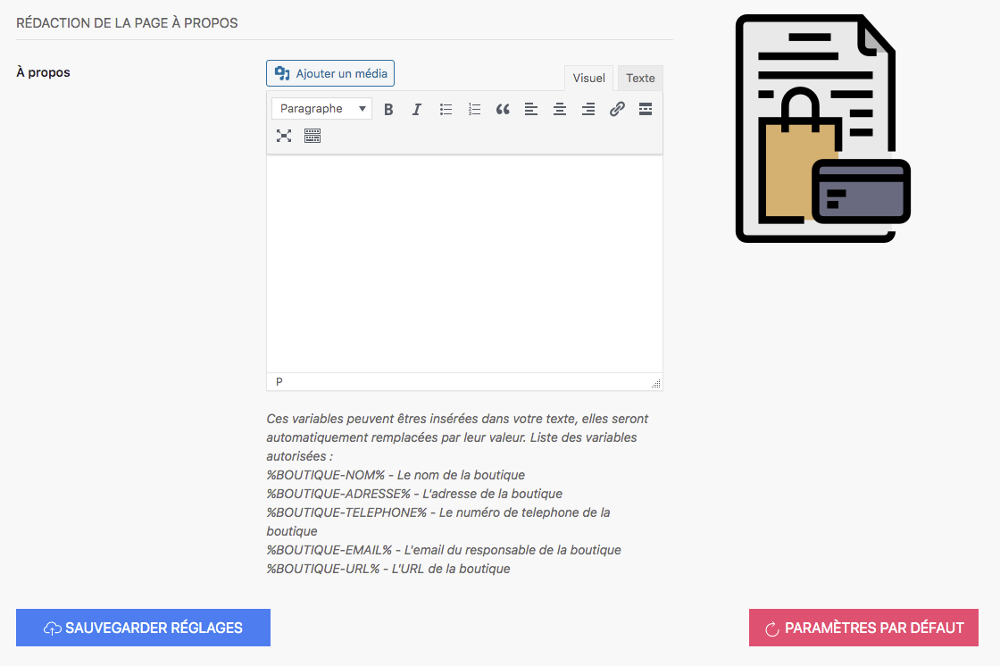

La page À propos est une page fortement recommandée pour un site internet ; elle doit rassurer vos visiteurs sur votre histoire, votre philosophie d'entreprise, ou encore les bases de fondement de votre entreprise. Afin de vous faciliter la production de ce contenu, 123VenteFlash vous propose deux solutions : 

- la génération d'un texte automatique utilisant des variables*
- la possibilité d'écrire votre page personnalisée À propos et de l'intégrer dans l'éditeur de texte

>>>>>> *Les variables sont des éléments que vous avez remplis dans les pages précédentes comme le nom de votre boutique dans la rubrique générale. La nomenclature des variables est codifiée. Il faut donc respecter impérativement cette nomenclature. 

Vous avez également la possibilité d'ajouter une photo, une image ou tout autre média si vous le souhaitez. 