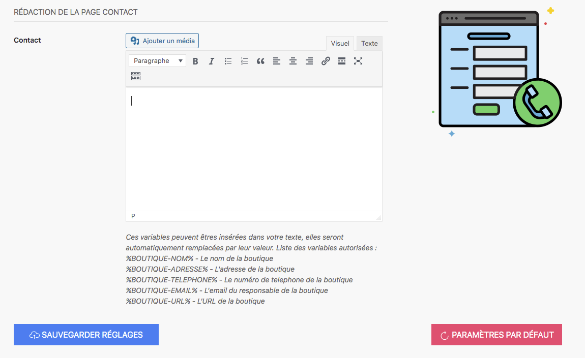

Le formulaire de contact est une page importante dans le processus d’assurance des visiteurs. Ils ont peut-être des questions ou ont besoin de vous contacter pour obtenir des informations introuvables (ou non) sur votre site internet. Pour cela, il est important de proposer un formulaire. 

Le contenu du formulaire peut contenir les éléments suivants : 
- les variables de programmation 
- une note sur le RGPD
- les conditions d’utilisation des données personnelles récoltées
- etc.

Vous avez également la possibilité d’ajouter une photo, une image ou tout autre média si vous le souhaitez.
