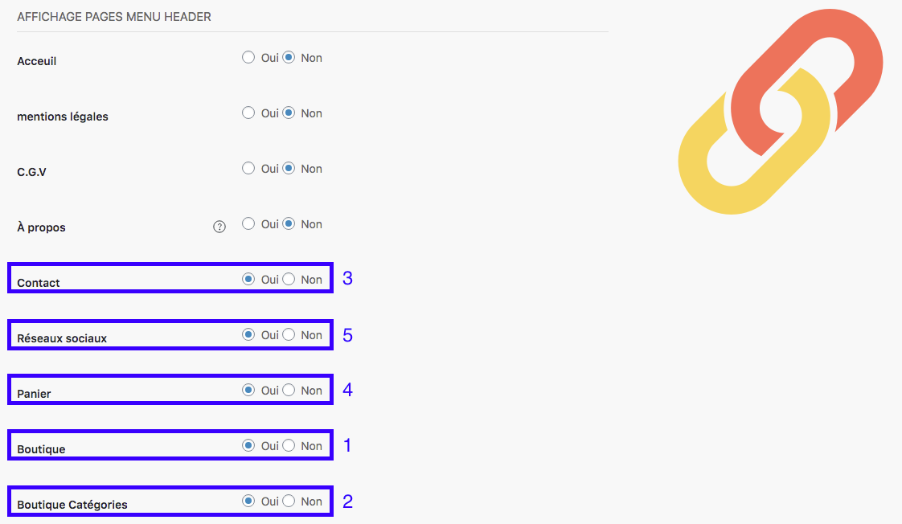

*Header* signifie en-tête en anglais. Dans cette rubrique, vous êtes invité à définir quels sont les éléments que vous souhaitez faire apparaître dans l'en-tête de votre boutique, y compris le menu. 

Ainsi, vous avez plusieurs éléments à vérifier, dont : 
- Accueil 
- Mentions légales
- CGV
- À propos
- Contact (3)
- Réseaux sociaux (5)
- Panier (4)
- Boutique (1)
- Catégories (2)

>>> À noter que pour la page À propos, celle-ci ne s'affichera dans le menu que si vous avez choisi, au préalable, de renseigner du contenu. 

Exemple : 

Selon vos besoins d’affichage, vous pouvez choisir les éléments présents dans la liste. 

>>>>> Vous avez la possibilité de faire un affichage différent selon le lieu de connexion de votre visiteur : ordinateur de bureau ou smartphone.
