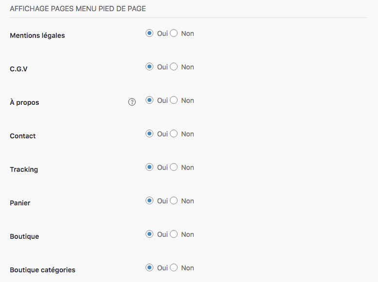
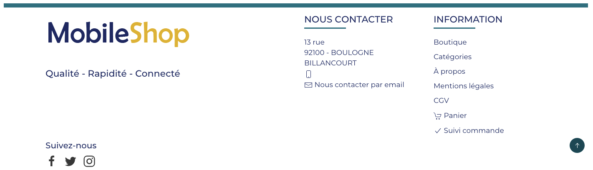
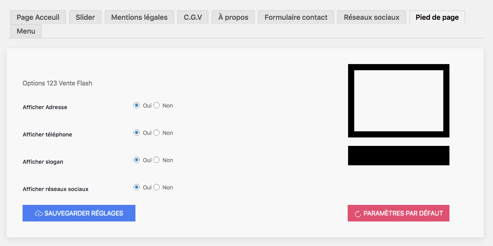

*Footer* signifie pied de page, soit la partie la plus basse de votre boutique. Cette zone contient des éléments d'assurance classiques destinés aux visiteurs. Elle contient généralement une adresse ou un lien vers un formulaire de contact, ainsi que des liens vers des pages présentes ou absentes du menu d'en-tête. 

Toujours dans la rubrique MENU, vous pouvez choisir les éléments affichés pour votre pied de page. 

Contrairement au Header (menu d'en-tête), l'affichage se fait uniquement sous la forme de liens, comme dans cet exemple : 

>>>>> Les réseaux sociaux sont affichés automatiquement à conditions que vous ayez rempli les liens dans la rubrique [Réseaux sociaux](https://guide.123venteflash.com/arborescence/reseaux).

## Onglet Pied de page

Dans le pied de page, il y a 2 colonnes qui sont à paramétrer : 

- INFORMATIONS : elle contient les liens vus plus haut, à faire afficher automatiquement sur toutes les pages
- NOUS CONTACTER : elle renseigne le visiteurs sur les éléments préalablement remplis dans la [rubrique générale](https://guide.123venteflash.com/reglages/generale) de votre boutique. 

