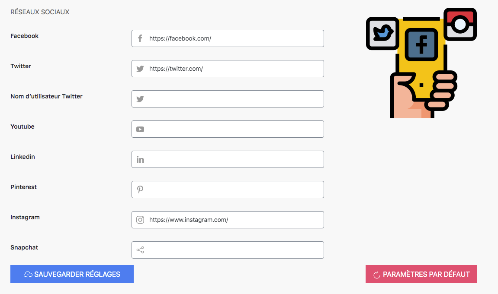
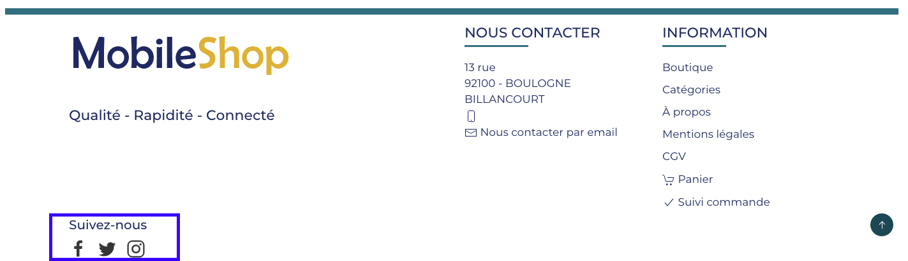

Si votre boutique est aussi présente sur les réseaux sociaux, vous pouvez aisément faire un lien vers ceux-ci. Pour les activer, il suffit de copier votre adresse URL sur les réseaux et la coller sur la ligne correspondante : 

>>> N'oubliez pas de sauvegarder vos paramètres ! 

Exemple visible sur l’en-tête de toutes les pages, mais aussi sur le footer. 

et 

