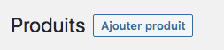
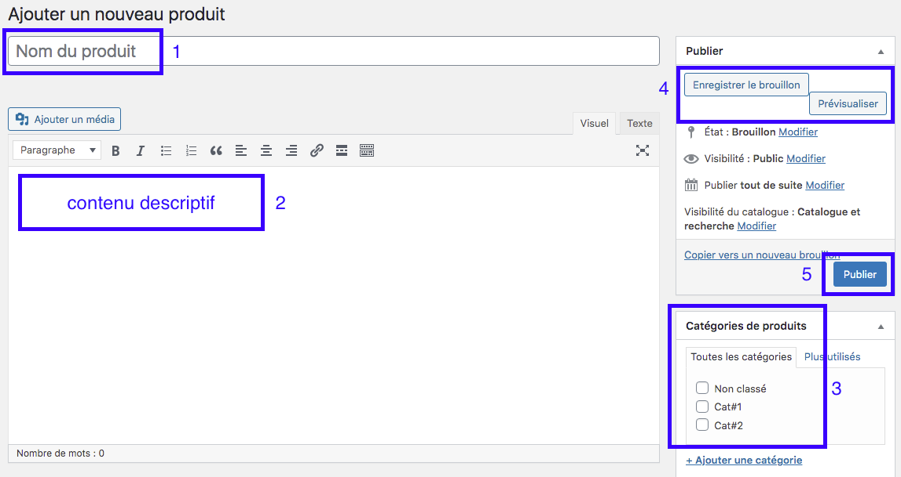
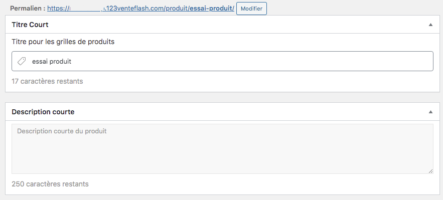
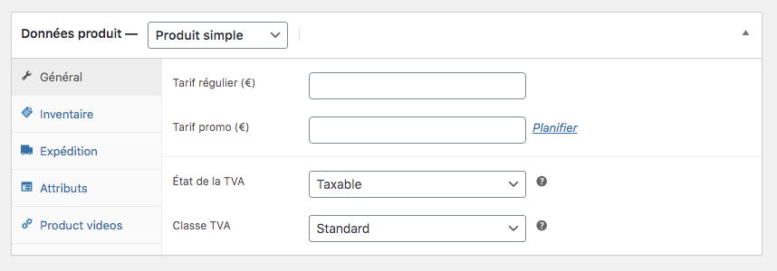
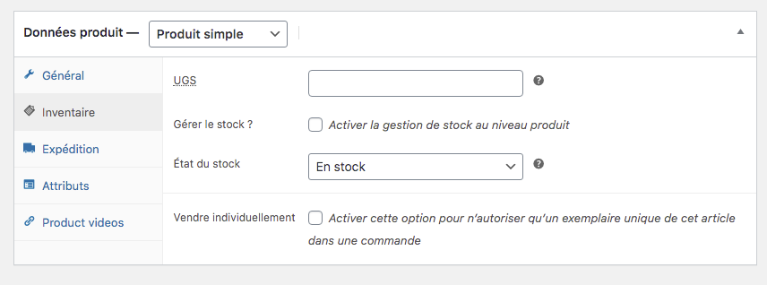
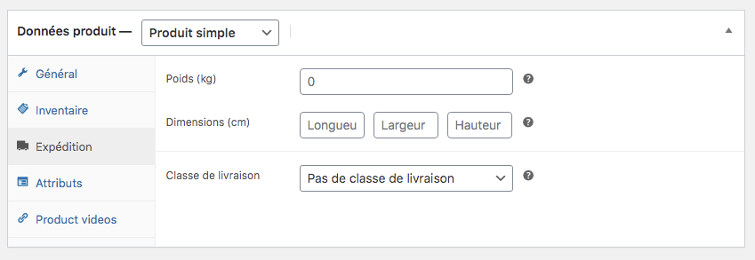
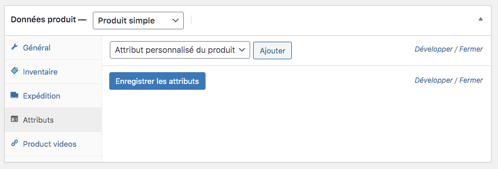
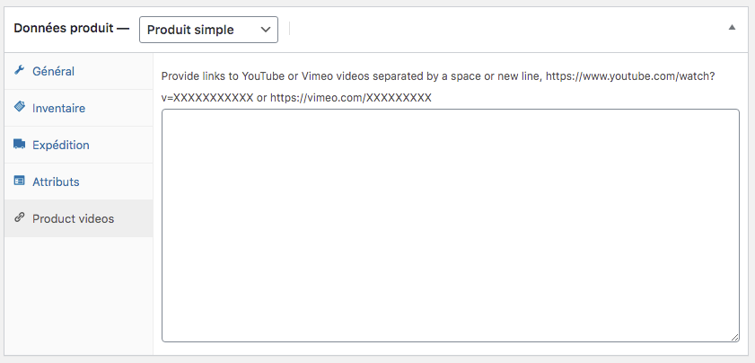
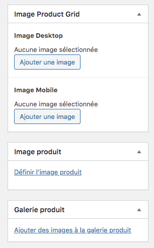

### Ajouter un nouveau produit dans votre catalogue

Lorsque vos catégories sont bien renseignées, vous pouvez commencer à enregistrer vos produits. Pour cela, cliquez sur le menu TOUS LES PRODUITS dans la colonne de gauche. 

C'est ici que vous trouverez la liste de tous les produits de votre catalogue. Commençons par entrer un premier produit. Cliquez donc sur le bouton AJOUTER PRODUIT en haut à droite. 

Vous arrivez ensuite sur l'interface du produit. Vous devez renseigner le nom du produit (1) ainsi que le contenu descriptif (2) dans l'éditeur situé juste en-dessous. 

Maintenant, il faut classer votre produit dans la bonne catégorie en la sélectionnant dans le cadre Catégories de produits (3). 
Si, pour une raison ou une autre, il vous manque une catégorie, vous avez un accès rapide pour en ajouter une en cliquant sur le lien *Ajouter une catégorie*. 

Si vous oubliez de renseigner une catégorie pour un produit, celui-ci sera automatiquement rangé dans la catégorie *Non classé*. 

Pensez ensuite à sauvegarder votre produit en cliquant sur le bouton Enregistrer le brouillon (4). Le bouton *Prévisualiser* vous sert à voir comment votre contenu, vos photos et votre produit va apparaître pour les visiteurs. 

Sauvegardez après noté le titre de votre article. Deux cadres supplémentaires vont alors apparaître : 
- le titre court : noter le nom de votre produit
- la description courte : rédiger une description de 50 mots environ pour présenter votre produit et donner envie au visiteur d'en savoir plus 

Lorsque vous aurez tout rempli (titre, contenu, catégorie, produit simple ou variable, images), il vous restera à appuyer sur le bouton PUBLIER (5). 

! Notre conseil pour la rédaction : dans le contenu descriptif, pensez à donner des informations différentes de celles de votre fournisseurs ou de vos concurrents pour éviter de dupliquer du contenu. 

### Produit simple : onglet général 

Maintenant que vous avez rempli les éléments principaux de votre fiche produit, il est temps de remplir les onglets suivants. Un produit simple est un produit qui ne comporte aucune variable que ce soit dans la couleur, la forme ou encore la matière. 

Dans l'onglet général, vous pouvez remplir : 
- le prix de vente
- le prix promotionnel (si vous souhaitez en proposer un)
- la TVA applicable
- le taux de TVA

### Produit simple : onglet Inventaire

Dans cet onglet, vous pouvez indiquer quelques renseignements intéressants pour votre gestion de stock : 

- UGS : code unique d'identification de votre produit
- Gestion de stock : pour pouvez choisir d'intégrer ce produit dans votre gestion de stock ou non. 
- Etat de stock : vous pouvez indiquer l'état du stock de votre produit (en stock, en rupture de stock ou en cours de réapprovisionnement)
- Vendre individuellement : en cochant cette case, vous indiquez aux clients qu'ils ne peuvent commander qu'un seul produit par commande. 

### Produit simple : onglet expédition

Concernant l'expédition de votre produit, vous pouvez indiquer certains éléments afin de suivre les expéditions, leur coût pour vous et la rentabilité. 

Ainsi, vous pouvez renseigner : 
- le poids du produit dans son colis (pensez à compter les produits d'emballage)
- les dimensions du paquet envoyé

### produit simple : onglet Attributs

Les attributs de produits sont un autre moyen permettant de regrouper des produits. En effet, dans le cas produits simples, il n'est pas nécessaire de remplir cette rubrique. Elle est toutefois essentielle dans on veut classer des produits variables. 

Si vous avez des produits avec un attributs qui changent comme la couleur, la forme, la taille et/ou la matière, commencez par rentrer vos attributs (nom de l'attribut + variables). 

Dès lors que vous entrez des attributs dans votre produit simple, celui-ci devient alors un produit variable. 

### produit simple : onglet Product videos

Si, pour votre produit simple, vous disposez d'une vidéo de présentation ou une vidéo à 360° par exemple, c'est ici que vous allez pouvoir l'insérer. Ces vidéos proviennent de la plateforme Youtube, Dailymotion ou Viméo. 

Pour cela, vous devez récupérer l'adresse où est stockée votre vidéo et copiez-la puis collez-la dans le cadre prévu à cet effet. 

! N'oubliez surtout pas de sauvegarder vos modifications en cliquant sur le bouton : Enregistrer brouillon

### Insérer les images du produit

Lorsque vous avez soigneusement rempli tous les cadres de fonctionnalité de votre produit, il vous reste à insérer les images d'illustration. 

Vous avez plusieurs images à renseigner dans ce cadre : 
- l'image principale qui sera affichée pour le visiteur depuis son ordinateur (image desktop)
- l'image principale qui sera affichée pour le visiteur depuis son smartphone (image mobile)
- l'image de votre produit (qui peut être identique à celle vue par le visiteur sur son ordinateur)
- une série d'images présentant le produit sous la forme d'une galerie

