## Ajouter un nouveau produit dans votre catalogue

Lorsque vos catégories sont bien renseignées, vous pouvez commencer à enregistrer vos produits. Pour cela, cliquez sur le menu TOUS LES PRODUITS dans la colonne de gauche. 

C’est ici que vous trouverez la liste de tous les produits de votre catalogue. Commençons par entrer un premier produit. Cliquez donc sur le bouton AJOUTER PRODUIT en haut à droite. 

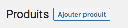

Vous arrivez ensuite sur l’interface du produit. Vous devez renseigner le nom du produit (1) ainsi que le contenu descriptif (2) dans l’éditeur situé juste en dessous. 

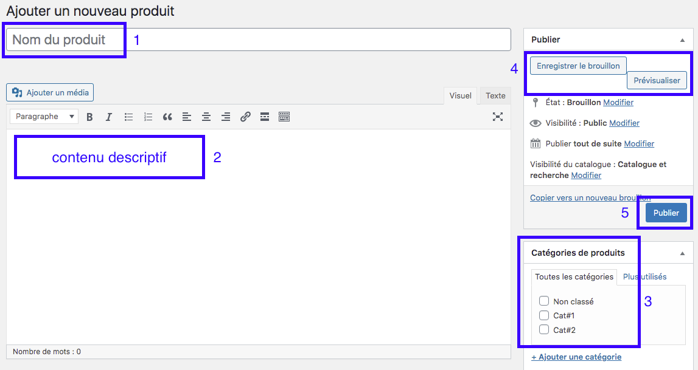

Maintenant, il faut classer votre produit dans la bonne catégorie en la sélectionnant dans le cadre Catégories de produits (3). 
Si, pour une raison ou une autre, il vous manque une catégorie, vous avez un accès rapide pour en ajouter une en cliquant sur le lien *Ajouter une catégorie*. 

Si vous oubliez de renseigner une catégorie pour un produit, celui-ci sera automatiquement rangé dans la catégorie *Non classé*. 

Pensez ensuite à sauvegarder votre produit en cliquant sur le bouton Enregistrer le brouillon (4). Le bouton *Prévisualiser* vous sert à voir comment votre contenu, vos photos et votre produit vont apparaître pour les visiteurs. 

Sauvegardez après avoir noté le titre de votre article. Deux cadres supplémentaires vont alors apparaître : 
- le titre court : noter le nom de votre produit
- la description courte : rédiger une description de 50 mots environ pour présenter votre produit et donner envie au visiteur d’en savoir plus 

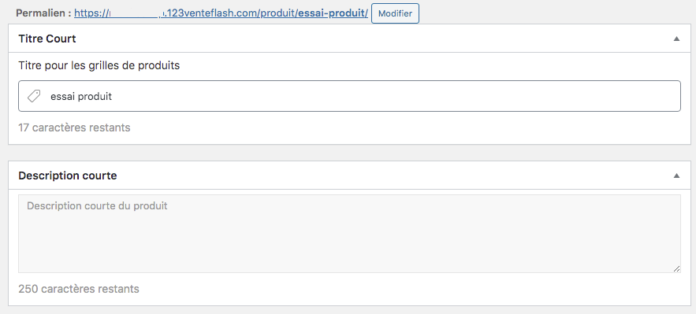

Lorsque vous aurez tout rempli (titre, contenu, catégorie, produit simple ou variable, images), il vous restera à appuyer sur le bouton PUBLIER (5). 

! Notre conseil pour la rédaction : dans le contenu descriptif, pensez à donner des informations différentes de celles de votre fournisseur ou de vos concurrents pour éviter de dupliquer du contenu. 

### Produit variable : onglet général 

Maintenant que vous avez rempli les éléments principaux de votre fiche produit, il est temps de remplir les onglets suivants. Un produit simple est un produit qui ne comporte aucune variable que ce soit dans la couleur, la forme ou encore la matière. 

Dans l’onglet général, vous pouvez remplir : 
- la TVA applicable
- le taux de TVA

!!! Le prix des produits sera à renseigner dans la variation elle-même, et non sur le produit de base comme c’est le cas dans les produits simples.

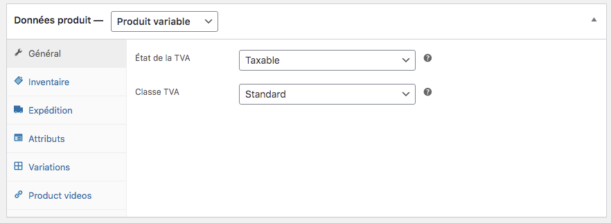

## Produit variable : onglet Inventaire

Dans cet onglet, vous pouvez indiquer quelques renseignements intéressants pour votre gestion de stock : 

- UGS : code unique d’identification de votre produit
- Gestion de stock : vous pouvez choisir d’intégrer ce produit dans votre gestion de stock ou non. 
- Vendre individuellement : en cochant cette case, vous indiquez aux clients qu’ils ne peuvent commander qu’un seul produit par commande. 

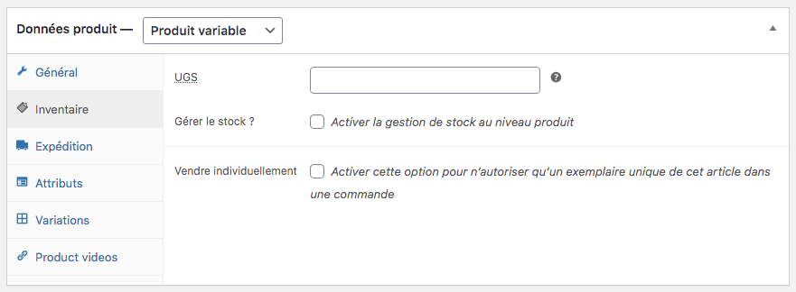

! Contrairement aux produits simples, l’état du stock n’est pas à renseigner ici, mais dans l’onglet variations.

## Produit variable : onglet expédition

Concernant l’expédition de votre produit, vous pouvez indiquer certains éléments afin de suivre les expéditions, leur coût pour vous et la rentabilité. 

Ainsi, vous pouvez renseigner : 
- le poids du produit dans son colis (pensez à compter les produits d’emballage)
- les dimensions du paquet envoyé

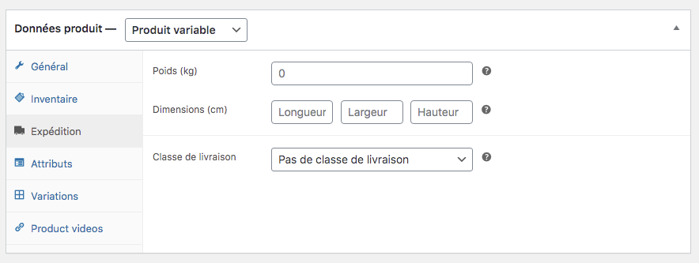

## Produit variable : onglet Attributs

Avant de rentrer les variations, vous devez renseigner les attributs de votre produit. Vous avez de nombreux choix, mais vous êtes limités à 50 attributs par produit. 

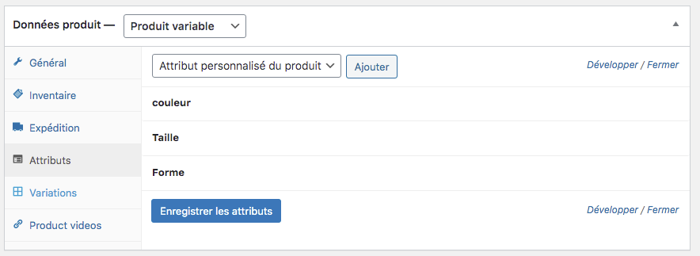

!!! En exemple, ici, nous avons choisi 3 attributs : la couleur, la taille et la forme. Mais vous pouvez entrer les attributs dont vous avez besoin. Il n’y a pas de liste déroulante, c’est à vous de nommer votre attribut. 

## Produit variable : onglet variations

Pour créer vos variations de produit, il faut impérativement avoir créé des attributs. Sinon le système ne fonctionne pas. Si aucune variation n’est possible alors que vous avez bien rentré des attributs, vérifiez que vous avez bien coché la case : utilisé en variation. 

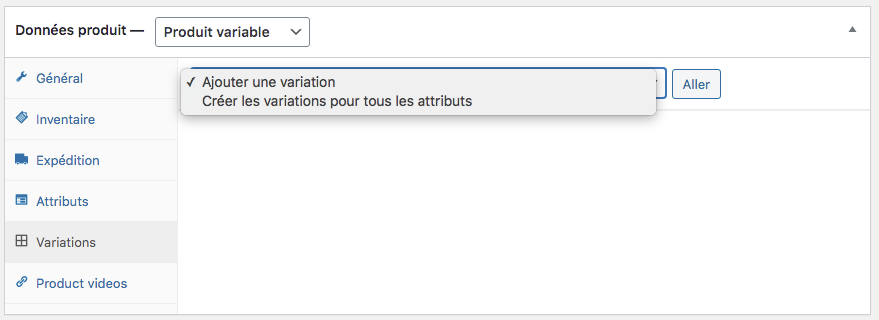

Vous avez 2 choix : 
- créer une variation selon des attributs combinés de manière précise
- créer une variation pour tous les attributs

Dans cet exemple, nous avons choisi de créer une variation à partir de tous les attributs :
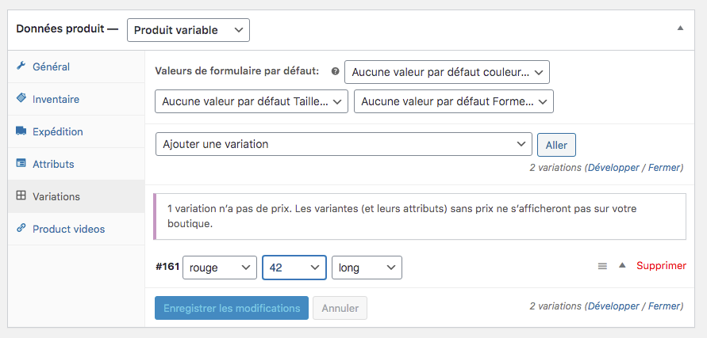

Ces variations sont créées de manière logique. Une fenêtre s’ouvre alors et vous pouvez renseigner tous les éléments dont vous avez besoin pour la vente : 

- le numéro d’identification du produit (UGS)
- le type : activé, téléchargeable, virtuel, ou gérer le stock
- le prix de vente
- le prix promotionnel (gestion et explications dans la rubrique code promo)
- Le poids du colis et ses dimensions
- la classe de livraison
- la classe de la TVA
- une description spécifique pour tous les attributs

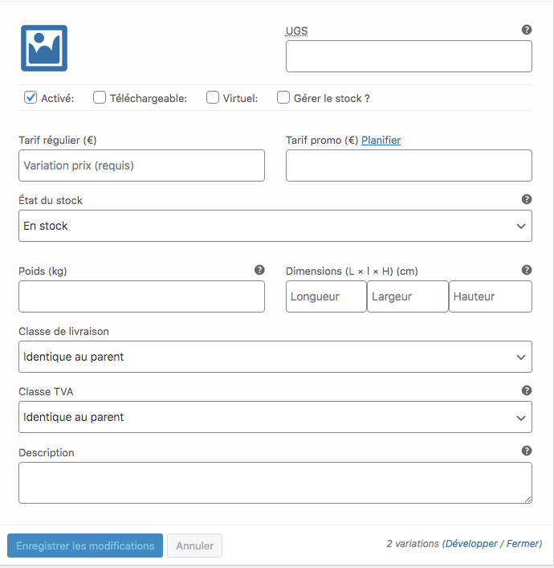

## Produit variable : onglet Product videos

Si, pour votre produit variable, vous disposez d’une vidéo de présentation ou une vidéo à 360 ° par exemple, c’est ici que vous allez pouvoir l’insérer. Ces vidéos proviennent de la plateforme YouTube, Dailymotion ou Viméo. 

Pour cela, vous devez récupérer l’adresse où est stockée votre vidéo et copiez-la puis collez-la dans le cadre prévu à cet effet. 

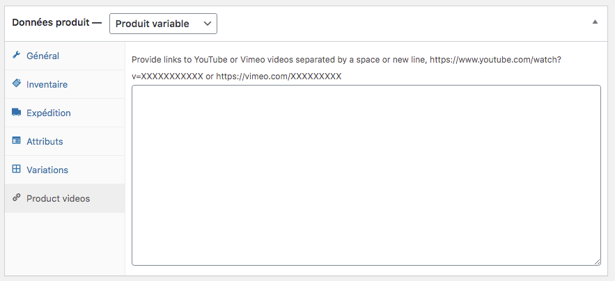

! N’oubliez surtout pas de sauvegarder vos modifications en cliquant sur le bouton : Enregistrer brouillon.

## Insérer les images du produit

Lorsque vous avez soigneusement rempli tous les cadres de fonctionnalité de votre produit, il vous reste à insérer les images d’illustration. 

Vous avez plusieurs images à renseigner dans ce cadre, en respectant les : 
- l’image principale qui sera affichée pour le visiteur depuis son ordinateur (image desktop) dans la grille des produits : 442 x 442 pxl
- l’image principale qui sera affichée pour le visiteur depuis son smartphone (image mobile) dans la grille des produits : 442 x 642 pxl
- l’image de votre produit (qui peut être identique à celle vue par le visiteur sur son ordinateur) : 700 x 420 pxl
- une série d’images présentant le produit sous la forme d’une galerie : 700 x 420 pxl

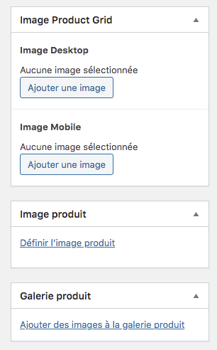
