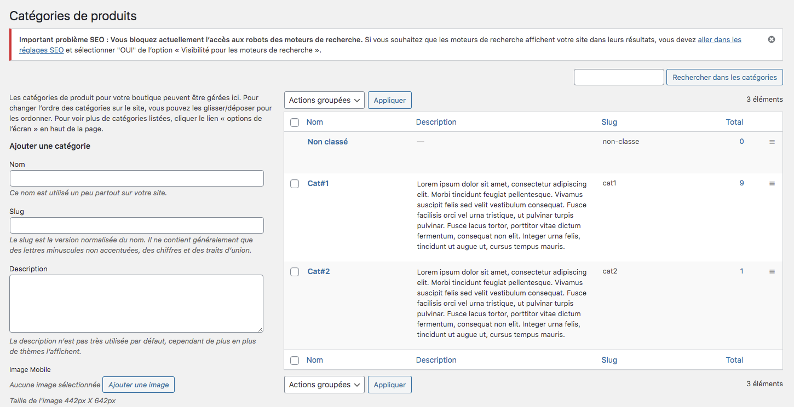

Avant d’entrer vos produits, nous vous conseillons de réfléchir à une arborescence de vos produits. Imaginez des catégories dans lesquelles vous devez ranger tous vos produits. 

Cette première étape est indispensable, car elle va permettre à vos visiteurs de naviguer dans votre boutique de manière intuitive, claire et précise. Plus vos catégories sont explicites, plus l’expérience de l’utilisateur est bonne. 

Lorsque vos catégories sont définies, il est temps de les renseigner dans votre boutique en ligne. Cliquez sur le menu *produits* puis *catégories*. Vous arrivez sur l’interface suivante : 

Vous avez un certain nombre d’informations à remplir, notamment : 
- le nom de la catégorie
- le slug (qui servira à construire l’URL automatique d’accès à votre catégorie)
- la description
- une série d’images de diverses tailles destinées aux mobiles, aux ordinateurs fixes ainsi qu’à la page catégorie elle-même. 

!!! Les dimensions idéales des images sont indiquées sur cette page. Pour savoir comment ajouter une image dans votre bibliothèque de médias, la procédure détaillée est indiquée dans la rubrique [Bibliothèque de médias](https://guide.123venteflash.com/divers/media/bibliotheque-media).

Vous pouvez entrer autant de catégories que vous le souhaitez. Elles vous serviront à classer vos produits et constituent la base de votre catalogue. 