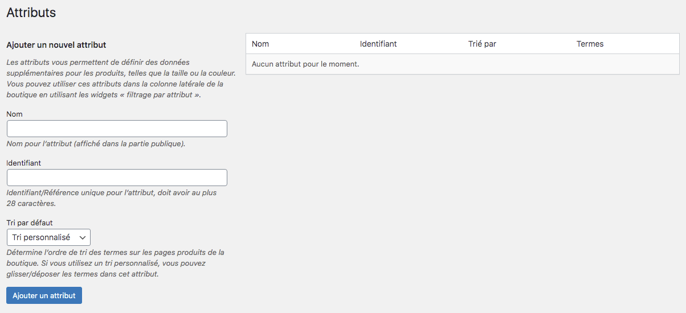
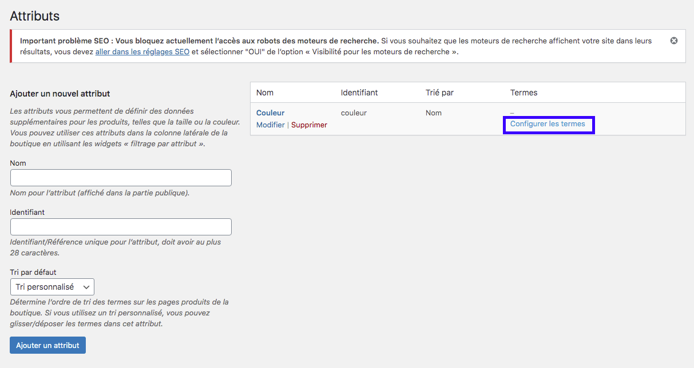
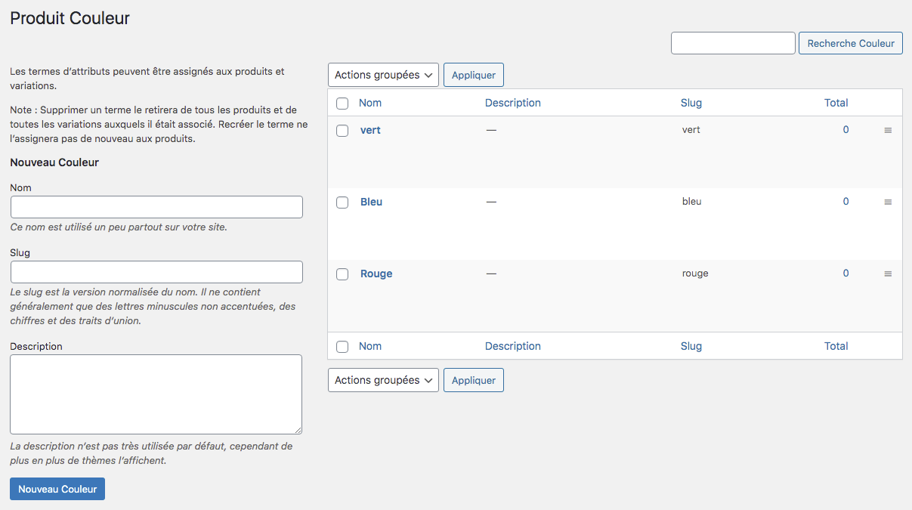

Vous avez 2 manières de renseigner vos attributs dans votre boutique en ligne. 

1. directement dans la fiche produit : [procédure sur les produits variables](https://guide.123venteflash.com/boutique/catalogue/produits-variables)
2. dans la rubrique Attributs depuis le menu dans la colonne de gauche

Pour entrer un attribut dans votre catalogue, il faut donc renseigner : 
- le nom 
- l’identifiant
- le type de tri : tri personnalisé (ordre de saisie), nom, nom numérique, ID Term

!!! Le nom et l’identifiant de votre attribut peuvent être identiques.

Lorsque vous avez entré votre attribut, celui est vide. Il faut donc cliquer sur le lien CONFIGURER LES TERMES pour entrer les variables. 

Ici, nous avons choisi de rentrer des couleurs, à savoir le rouge, le bleu et le vert. Le slug se remplit automatiquement. 
Dans cette interface, il vous est possible de noter une petite description de votre variable. Cela peut être intéressant lorsque vous avez des variables qui porte un nom très proche afin de pouvoir les différencier ou indiquer une information particulière. Notons que dans la boutique, la description n’est pas affichée à l’écran. C’est donc une donnée de gestion. 

