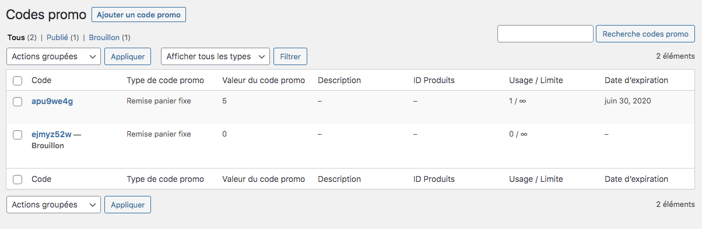
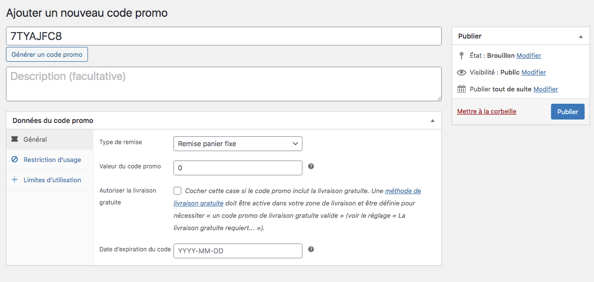
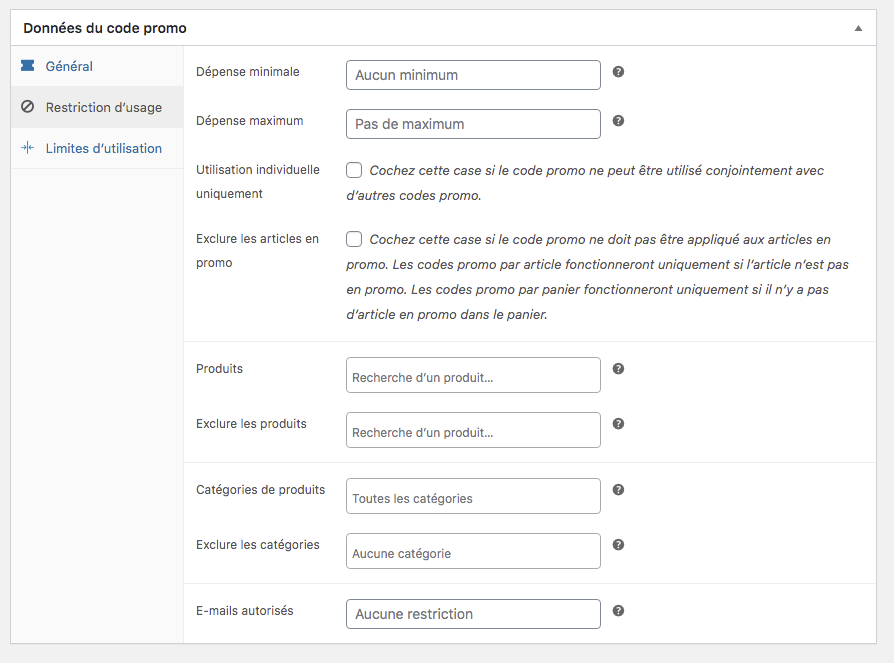
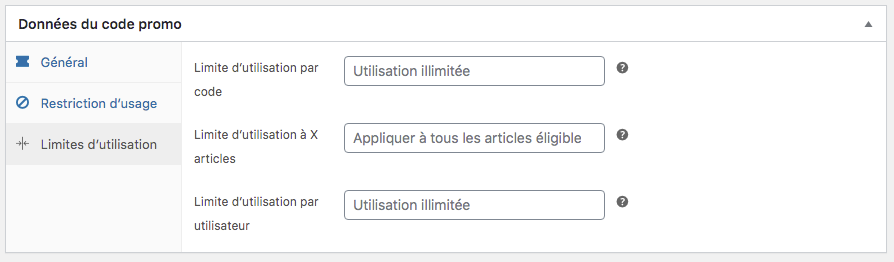
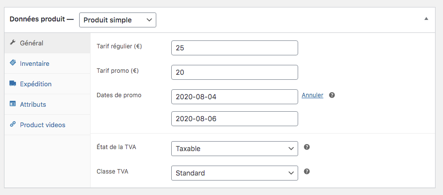
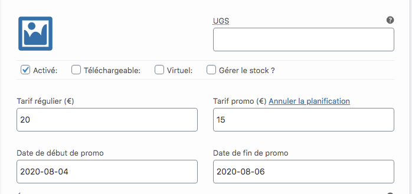

Pour créer un code promotionnel vous avec également 2 manières de procéder : 

1. Cliquer sur le menu CODES PROMO dans le menu dans la colonne de gauche
2. renseigner le code promo directement dans la fiche du produit simple ou variable que vous avez créé. 

## Menu code promo

Le premier avantage de créer un code promotionnel depuis ce menu est de pouvoir l’appeler dans les produits lorsque vous en avez besoin. Le second avantage est un paramétrage facile et rapide. 

Pour ajouter un nouveau code promotionnel, il suffit de cliquer sur le bouton : Ajouter un code promo

Vous arrivez sur une nouvelle fenêtre qui vous laisse 2 possibilités pour la création du code : 
- vous entrez votre code manuellement (exemple : noel2020)
- vous utilisez le générateur de code promo

Ensuite, il vous reste à remplir les champs suivants : 
- le type de remise : remise sur une commande, sur un produit fixe, ou bien une remise sous la forme d’un pourcentage. 
- La valeur du code promo
- autoriser la livraison gratuite sur le produit ou le type de remise choisie
- la date d’expiration du code promo 

L’onglet Restriction d’usage vous permet de paramétrer l’utilisation du code promo que peuvent en faire vos clients : 

Et pour finir, l’onglet limite d’utilisation vous permet de limiter l’usage du code promo selon vos conditions : 

## Tarif promo dans la fiche produit

Lors de la création de la [fiche produit simple](https://guide.123venteflash.com/boutique/catalogue/produits-simples) ou de la [fiche produit variable](https://guide.123venteflash.com/boutique/catalogue/produits-variables), nous avons vu qu’il était possible de renseigner un code promotionnel directement sur la fiche. Cela peut être pratique pour des raisons commerciales (lancement de produit, liquidation de stock, autre). 

Sur un produit simple, l’insertion d’un code promo est réalisé directement sur la fiche du produit dans l’onglet général : 

Vous devez renseigner : 
- le prix plein
- le prix promotionnel
- les dates de la promotion

Dans le cas d’un produit variable, le tarif promotionnel est à indiquer dans l’onglet Variations, sur chaque variation de produit. Il peut arriver que vous ayez un surstock sur une seule variation et la promotion ne s’appliquera alors que sur une variation. 

