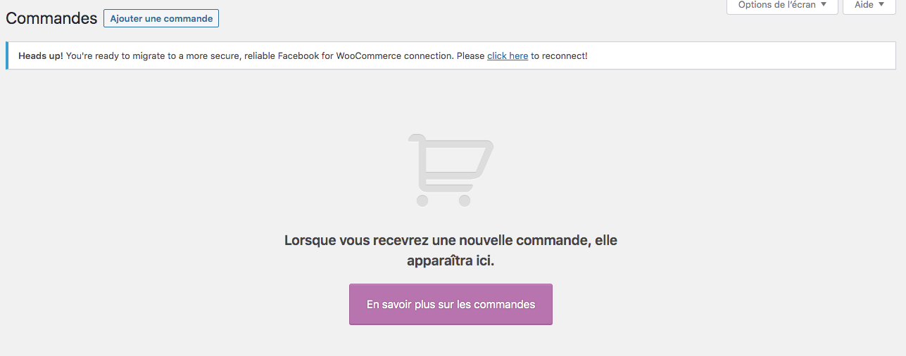
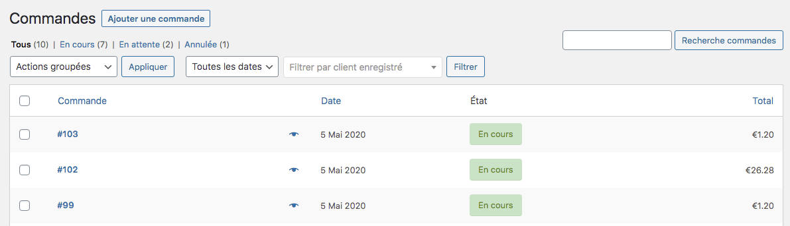
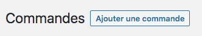
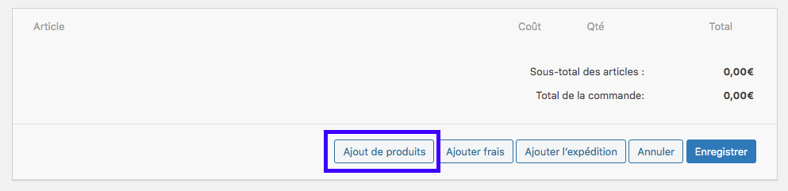
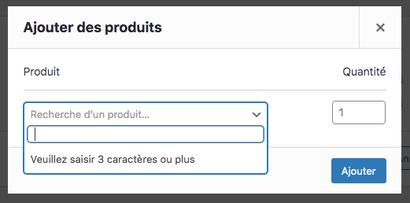
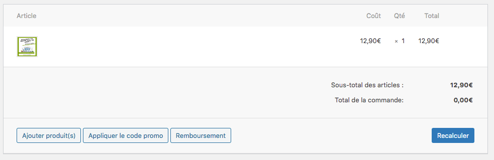
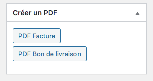
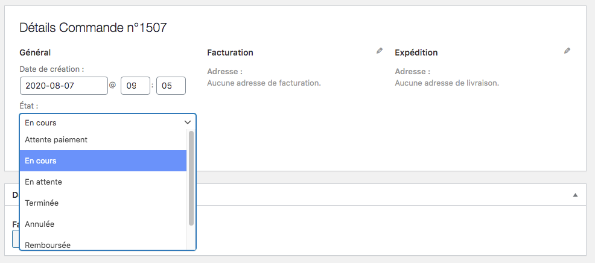
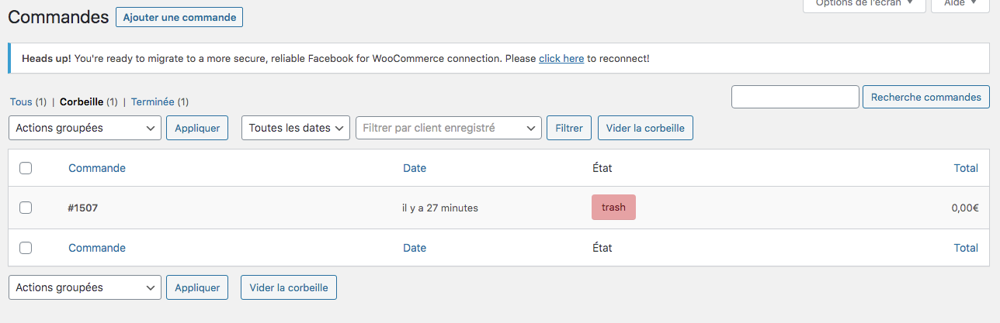

Votre boutique en ligne est dotée d'un suivi des commandes pour faciliter votre gestion commerciale. Au démarrage votre page est vide : 

Vos commandes deviennent le centre névralgique de votre business. Vous pouvez piloter votre gestion des commandes depuis cette interface. Plusieurs paramètres peuvent être étudiés. 

## Visualiser une commande

Pour visualiser une commande, cliquez sur le menu Commande dans la colonne de gauche. Vous avez alors accès à l'écran du tableau de commande qui se présente ainsi : 

Pour voir le détail de la commande, il suffit de cliquer sur la ligne qui vous intéresse. 

## Ajouter une commande manuellement

Les commandes se déversent automatiquement dans ce tableau de bord, où vous pouvez les consulter, les modifier mais également ajouter manuellement une commande dans le cas où votre client souhaite passer commande par téléphone ou par email auprès de votre service client. 

Pour ajouter une commande manuellement, il vous suffit de cliquer sur le bouton : Ajouter une commande 

Une nouvelle page de commande s'affiche à l'écran et vous devez remplir les champs : 
- client
- état de la commande
- produits commandés
- envoi de la facture en pdf

Dans un premier temps, vous pouvez : 

Ajouter un produit dans votre commande, en cliquant sur le bouton ajout de produits. 

Le logiciel vous propose de choisir vos produits dans votre liste de produits en saisissant les 3 premiers caractères du nom du produit commandé. 

Le produit est alors automatiquement inséré dans la commande. Vous pouvez en ajouter d'autres si vous le souhaite : 

Lorsque vous avez terminé d'entrer toutes les informations pour votre commande manuelle, vous pouvez cliquer sur le bouton créer. 

!! ATTENTION : il est impossible d'ajouter des produits à une commande créée manuellement. Prenez donc soin de mettre tous les produits au premier enregistrement. 

Note :
Il est possible de créer un PDF de facture et de bon de livraison que vous pouvez ensuite envoyer à votre client sur son adresse mail. 

## Modifier le statut d'une commande

Lorsque votre commande est disponible dans le tableau de bord, vous pouvez indiquer à votre client le statut de sa commande. Pour cela, il suffit de cliquer sur la ligne de commande. 

Vous entrez alors dans le détail de la commande pour modifier le statut. 

Choisissez le nouveau statut et cliquer ensuite sur METTRE À JOUR lorsque vous avez terminé. 

## Supprimer une commande

Si, pour une raison ou une autre, vous souhaitez supprimer une commande de votre tableau de bord. 

Pour cela, cliquez sur la ligne concernée et entrez dans le détail. À côté du bouton de mise à jour, il y a un lien rouge qui indique : mettre à la corbeille. 

![bouton-supprimer-commande-guide-123venteflash]bouton-supprimer-commande-guide-123venteflash.png)

En cliquant sur ce lien, votre commande change de statut dans votre tableau de bord et disparaît de l'écran principal. Cette commande est alors rangée dans la rubrique CORBEILLE. C'est dans cette rubrique que vous trouverez toutes les commandes supprimées. 

