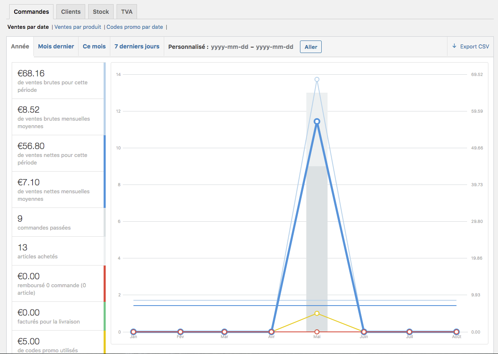
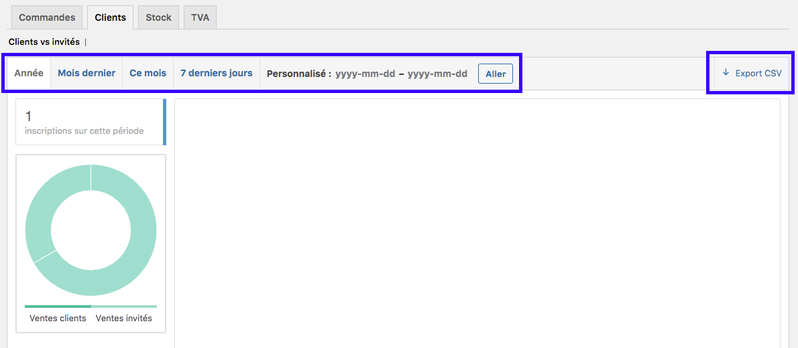
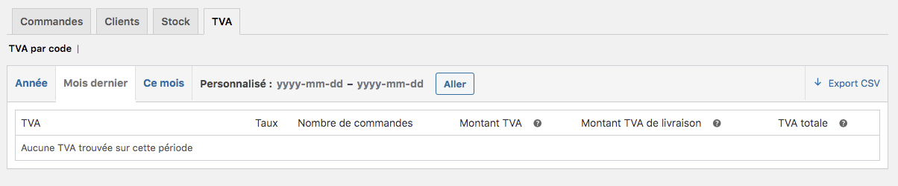

## Suivi des commandes 

Grâce à votre boutique en ligne, vous disposez d’un système de rapport de commandes qui vous donnent de précieuses informations pour remplir vos tableaux de suivis ou tout simplement pour suivre l’évolution de votre business visuellement. 

Ce premier tableau de bord (ventes par date) vous permet de suivre de nombreux indicateurs dont : 

- les ventes brutes pour une période donnée
- les ventes brutes mensuelles moyennes
- les ventes nettes pour une période donnée
- les ventes nettes mensuelles moyennes
- le nombre de commandes passées dans votre boutique
- le nombre d’articles achetés
- le montant des remboursements clients
- le montant de facturation de livraison
- le montant des codes promo utilisés

Ensuite, vous pouvez afficher les :
- ventes par produit afin de savoir quel est le produit le plus vendu sur une période donnée
- la liste des meilleures ventes du mois
- etc. 

Pour finir, vous pouvez également savoir comment et quand ont été utilisés les codes promo, en fonction d’une période donnée. 

## Clients

Le second onglet de votre tableau de rapport est celui des clients. 

Ce tableau vous permet de savoir combien de nouveaux clients ont commandé sur votre boutique sur une période donnée. Cette donnée est intéressante pour établir une saisonnalité par exemple. 

!!!! Note intéressante : vous pouvez exporter votre liste de client sur un fichier CVS. Si vous utilisez un logiciel de gestion commerciale, cela peut être intéressant pour vous de récupérer la liste des clients pour des actions en marketing ciblé par exemple. 

## Stock

Ce rapport sur les stocks vous indique l’état de votre stock dans votre boutique à ce jour. 

Ainsi, vous pouvez surveiller vos stocks. 
Pensez à bien renseigner cette donnée dans vos fiches produits afin que ce tableau reflète au mieux la réalité de votre stock. 

!!!! Procédure de renseignement du stock : [comment bien remplir la fiche produit ?](https://guide.123venteflash.com/boutique/catalogue/produits-simples) 

## TVA

Le dernier rapport disponible est celui de la TVA. Il vous permet de savoir quel montant de TVA est à déclarer à l’administration fiscale pour votre boutique. 

