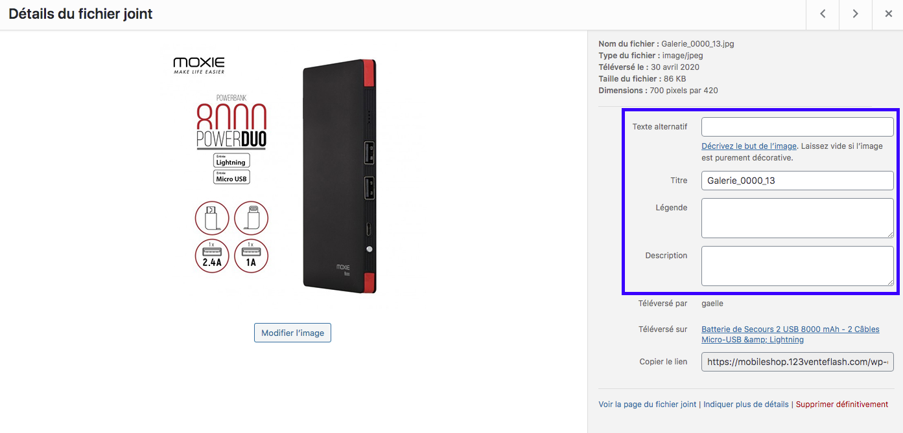

Afin de vous aider à trouver d'autres ressources pour votre boutique en ligne, nous avons choisi de mettre à votre disposition des ressources. Sous la forme de lien, de conseils ou de tutos détaillés, vous trouverez surement quelques éléments inspirants pour améliorer votre boutique. 

Si vous rencontrez des difficultés ou des incompréhensions, n'hésitez pas à nous envoyer un message. Nous tâcherons de vous aider au mieux. 

Dans cette rubrique (qui va s'enrichir au fil du temps), vous trouverez déjà : 

- des liens utiles comme une liste de banques d'images libres de droit
- une aide pour alléger vos images et augmenter la vitesse de chargement de vos pages
- un tuto pour bien remplir la fiche détail de vos médias

### Trouver des photos et images libres de droit

Il existe des banques d'images libres de droit et utilisables par les professionnels dans le cadre d'une exploitation commerciale. Certaines de ces banques d'images sont gratuites et d'autres sont payantes. Mais dans les cas, vous devriez trouver votre bonheur. 

Banques d'images gratuites : 
- [Unsplash](https://unsplash.com/) 
- [Pixabay](https://pixabay.com/fr/)
- [Freepik](https://fr.freepik.com/) 

Banque d'images payantes : 
- [Adobe Stock](https://fr.fotolia.com/) (anciennement Fotolia)
- [Istockphoto](https://www.istockphoto.com/fr)
- [Shutterstock](https://www.shutterstock.com/fr/) 

En parcourant le web, vous en trouverez certainement d'autres. Soyez prudent sur les licences et vérifiez bien que celles-ci sont exploitables commercialement. 

! Notre conseil : pensez à mettre les crédits photos dans vos mentions légales afin de rester dans le cadre de la loi. 

### Remplir les détails de la fiche média

Vous vous demandez peut-être, lorsque vous avez rentré vos médias dans votre bibliothèque s'il est important de remplir la fiche. La réponse est oui. Mais pour cela, il est préférable de respecter quelques règles du SEO. 

!!!! Conseil 1 : choisir avec soin le nom du fichier. Avant même d'importer votre média dans votre bibliothèque, prenez le temps de le renommer en insérant vos mots-clés. La nomenclature est la suivante : descriptif-motcle-nomdevotreboutique.jpg

!!!! Conseil 2 : copier-coller votre nom de fichier dans les cases du texte alternatif et de la description. 

La légende correspond à un texte qui apparaîtra dans la fiche produit elle-même. Vous pouvez choisir de remplir ce champs ou non. 

La sauvegarde est automatique. 

### Alléger vos images pour un meilleur SEO

Pour attirer le client, il est important d'avoir des médias de très bonne qualité, notamment dans les fiches produits de votre catalogue. Toutefois, certaines images de très haute qualité peuvent être TRÈS lourde et ralentir l'affichage des pages de votre boutique auprès de vos visiteurs (surtout ceux dont la connexion est mauvaise - ce qui est indépendant de la qualité de votre boutique bien entendu). Pour limiter ce souci, nous vous recommandons de mettre toutes les chances de votre côté et d'alléger vos médias photos au maximum, sans perdre leur qualité. 

Pour cela, avant de les importer dans votre bibliothèque, vérifiez leur taille. Il n'est pas toujours nécessaire d'avoir des images d'une taille gigantesque (4000 ou 5000 x 2000 qui pèsent 3Mo...) pour offrir un visuel de qualité. 

Passez donc toutes vos images, systématiquement, dans un logiciel de compression. Rendez-vous sur [TINYPNG](https://tinypng.com/). 

TinyPng est un compresseur d'images gratuit qui accepte les formats PNG et JPG. Ainsi, vous gagnez en vitesse de chargement très facilement.